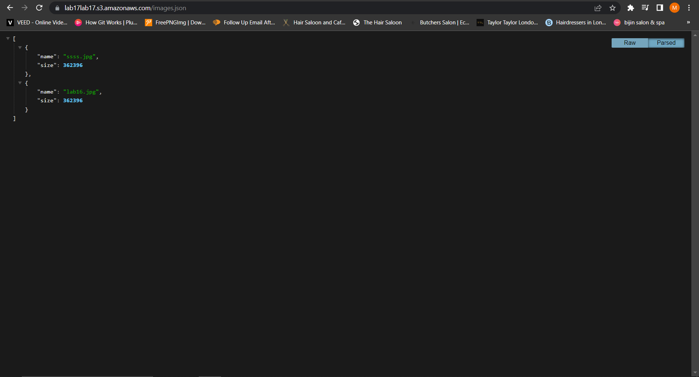
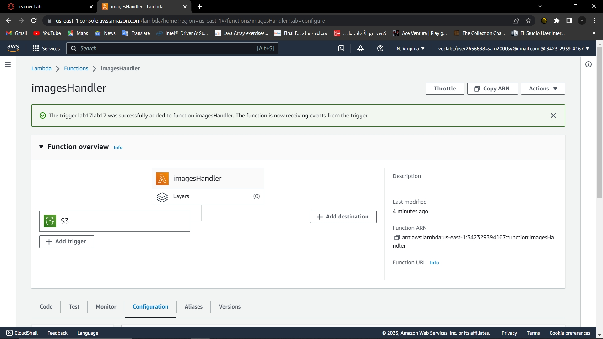
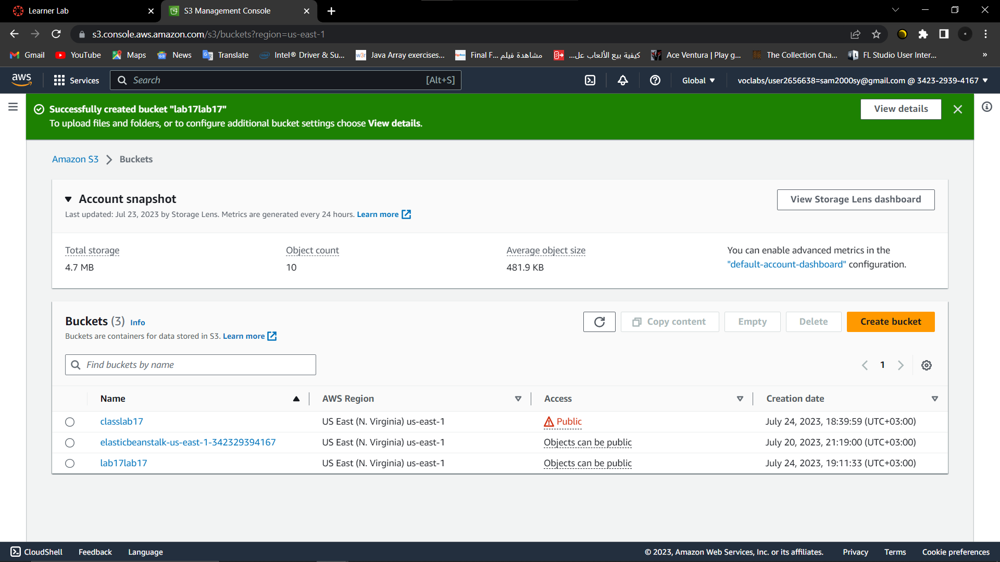

# image-lambda

Authors: Sham Al-Jalam, Mohammed Attallah
---

### URLs
deployed application : https://lab17lab17.s3.amazonaws.com/images.json


### process:
an image handler function has been created with AWS Lambda to handle every images uploaded to AWS S3, following these steps:

created an AWS S3 bucket
created a lambda function
added the trigger to the Lambda function
wrote the code to return the json file
uploaded the zipped code to the lambda

**Running the app:**
* Returns Object
```Js
{
    [{"name":"ssss.jpg","size":362396},
    {"name":"lab16.jpg","size":362396}]
}
```

### sceenshots





